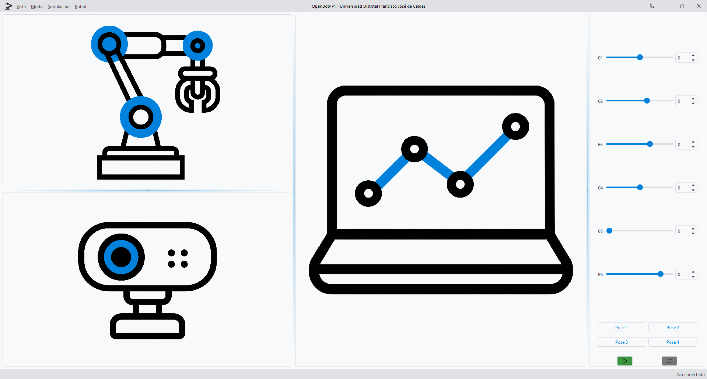
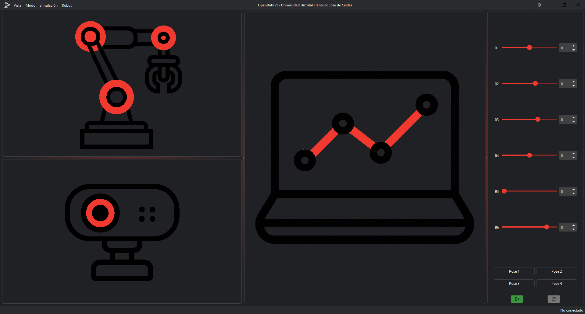

<!-- # Welcome to MkDocs

For full documentation visit [mkdocs.org](https://www.mkdocs.org).

## Commands

* `mkdocs new [dir-name]` - Create a new project.
* `mkdocs serve` - Start the live-reloading docs server.
* `mkdocs build` - Build the documentation site.
* `mkdocs -h` - Print help message and exit.

## Project layout

    mkdocs.yml    # The configuration file.
    docs/
        index.md  # The documentation homepage.
        ...       # Other markdown pages, images and other files. -->

# Bienvenido a OpenBotV Control Lab

Aquí encontrara la documentation necesaria para el uso de la aplicación y la explicación de algunas secciones del código de python que podría requerir editar para sus practicas de laboratorio de control.

La interfaz cuenta con 

| Tema Claro | Tema Oscuro |
|-------------|-------------|
|  |  |


```plantuml
!include assets/diagrams/openbot_architecture.puml


